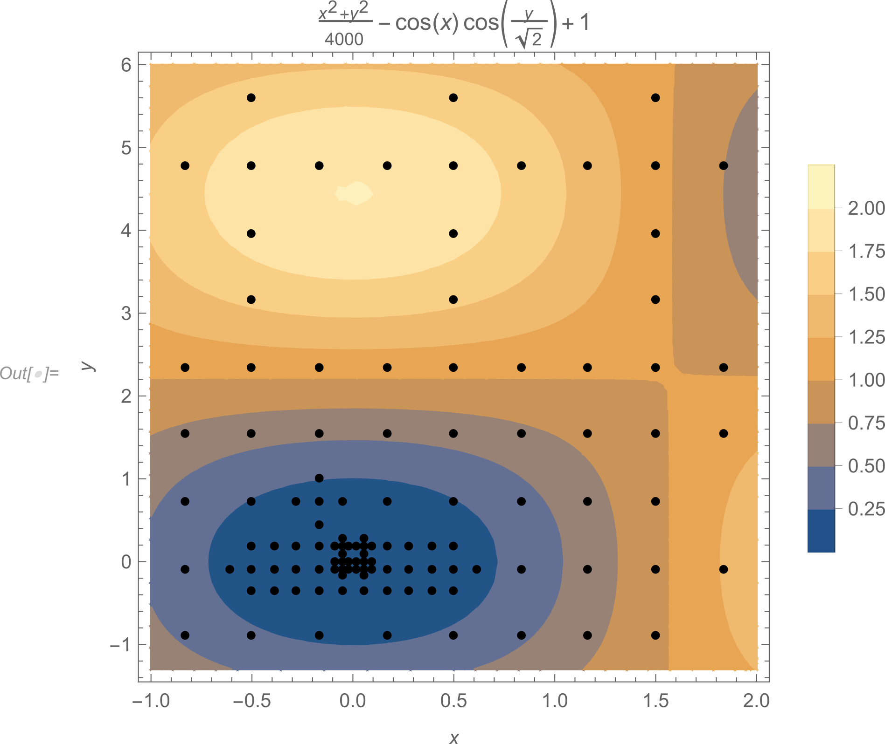

# ml-direct

[![NPM version][npm-image]][npm-url]
[![npm download][download-image]][download-url]

# Direct - DIviding RECTangles algorithm. 

The algorithm is intended to minimize real valued multivariate scalar fields over a hyper-rectangular region of N, theoretically the only prerequisite to achieve convergence is that the function must be continuous in the domain or at least continuous over a neighborhood of the global minimum. 

<p align="center">
  
</p>

<p align="center">
  A tool for global optimization of real valued functions .
</p>

## Installation

`$ npm i ml-direct`

## Usage

```js
import direct from 'ml-direct';

const options = {
    iterations: 25,
};

const lowerBoundaries = [-5, 3];
const upperBoundaries = [4, -2];

const quadratic = function (x) {
  let result = 0;
  for (let i = 0; i < x.length; i++) {
    result += Math.pow(x[i], 2);
  }
  return result;
};

const predicted = Direct(
    quadratic,
    lowerBoundaries,
    upperBoundaries,
    options,
);

// predicted.minFunctionValue = 0
// Array.from(predicted.optimum[0]) = [0, 0];

```

## [API Documentation](https://cheminfo.github.io/ml-direct/)

## License

[MIT](./LICENSE)

[npm-image]: https://img.shields.io/npm/v/ml-direct.svg
[npm-url]: https://www.npmjs.com/package/ml-direct
[ci-image]: https://github.com/cheminfo/ml-direct/workflows/Node.js%20CI/badge.svg?branch=master
[ci-url]: https://github.com/cheminfo/ml-direct/actions?query=workflow%3A%22Node.js+CI%22
[download-image]: https://img.shields.io/npm/dm/ml-direct.svg
[download-url]: https://www.npmjs.com/package/ml-direct
